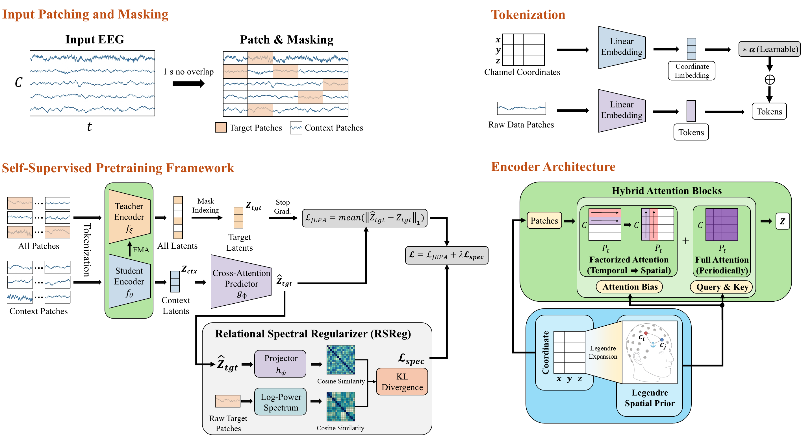

# SPERA_code

SPERA (Spherical Prior EEG Representation Architecture) is a JEPA-based EEG foundation model with a Legendre spherical prior and a relational spectral regularizer. The manuscript reports pretraining on approximately **80,000 hours from 31,771 subjects across 106 datasets**, with the highest average balanced accuracy across nine downstream tasks.

## Method and manuscript terminology

- **Hybrid attention:** temporal attention within each channel, then spatial attention within each time patch; every fourth block uses full attention.
- **Pairwise Legendre spatial bias** (Eq. 2): a learnable polynomial expansion of electrode cosine similarity, added to factorized spatial attention scores.
- **Legendre anchor geometry features** (Eqs. 3–4): channel features built from learnable spherical anchor directions, projected into full-attention queries and keys after temporal RoPE. This produces geometry–geometry and content–geometry interactions (Appendix F.3).
- **RSReg** (Eq. 5): KL divergence between spectral and predicted-latent similarity distributions, computed within each recording over target tokens, with the diagonal excluded, then averaged over recordings. Spectral views use Hann-windowed log-power in 1–45 Hz.

See [the manuscript review](docs/manuscript_ver07_review.md) for the changes affecting training and the remaining reproduction questions. This checkout contains no pretrained weights, real datasets, or experiment logs, so the reported scores have not been reproduced here.

## Installation

```bash
# From the downloaded repository root:
pip install torch numpy webdataset accelerate tqdm scikit-learn
```

Optional logging:

```bash
pip install wandb
```


## Quickstart

The quickstart contains two minimal examples:

1. Run a downstream-style forward pass with a SPERA encoder. 
(`quickstart.py downstream` only requires PyTorch.)

2. Run a short pretraining smoke test using synthetic WebDataset shards.
(`quickstart.py pretrain` and `pretrain.py` require `accelerate` and `webdataset`.)

### 1. Downstream-style forward pass

```bash
python quickstart.py downstream
```

By default this uses a randomly initialized Tiny encoder from `configs/model/spera_tiny_18m.json`. To load an encoder checkpoint explicitly:

```bash
python quickstart.py downstream --checkpoint_dir ./pretrained_weights/spera_base
```

The checkpoint directory must contain:

```text
./pretrained_weights/spera_base/
  config.json
  pytorch_model.bin
```

For downstream tasks, replace the mock EEG and coordinates with preprocessed EEG segments and electrode coordinates from your dataset.


### 2. Pretraining smoke test

```bash
python example_data/make_synthetic_shards.py --target_shard_size 4MB --length 2000

python quickstart.py pretrain
```

The first command creates synthetic WebDataset shards for the quickstart:

```text
example_data/
  shards.txt
  synthetic-000000.tar
  synthetic-000001.tar
```

Then quickstart.py pretrain runs a tiny pretraining smoke test using:

```text
configs/model/spera_tiny_18m.json
configs/pretrain/pretrain_smoke.json
```

The smoke configuration uses five updates, small token budgets, no mixed precision, and no external logging. It writes to `runs/quickstart` and deliberately shortens the schedules to exercise RSReg. It is a runtime check, not the paper's training recipe. `--mode downstream` and `--mode pretrain` are also accepted.

You can also run `pretrain.py` directly:

```bash
python pretrain.py \
  --model_cfg configs/model/spera_tiny_18m.json \
  --train_cfg configs/pretrain/pretrain_smoke.json \
  --shards_txt example_data/shards.txt \
  --output_dir runs/quickstart \
  --max_steps 5 \
  --no_wandb
```

With Accelerate:

```bash
accelerate launch --num_processes 1 pretrain.py \
  --model_cfg configs/model/spera_tiny_18m.json \
  --train_cfg configs/pretrain/pretrain_smoke.json \
  --shards_txt example_data/shards.txt \
  --output_dir runs/quickstart \
  --max_steps 5 \
  --no_wandb
```

Expected output:

```text
[params] encoder=...M predictor=...M aux=...M
[step 0000001] l1=... total=... lr=... ema=...
```

## Data Format

SPERA pretraining uses WebDataset tar shards. Each line of `shards.txt` should contain one tar path:

```text
./example_data/synthetic-000000.tar
./example_data/synthetic-000001.tar
```

Each sample inside a shard should contain:

```text
<sample_id>.eeg.npy
<sample_id>.coords.npy
```

with shapes:

```text
eeg.npy    : (num_channels, num_time_samples)
coords.npy : (num_channels, 3)
```

The default sampling rate is 200 Hz, and the default patch length is 1 second.

For example, a 10-second EEG segment sampled at 200 Hz should have:

```text
eeg.shape = (C, 2000)
```

and will produce:

```text
num_patches = 10
num_tokens  = C * 10
```

The provided files in `example_data/` are synthetic EEG-like arrays intended only for testing the data loader and training loop. They are not real EEG recordings and should not be used for scientific evaluation.


## Using Real EEG Data

To train on real EEG data, convert your preprocessed recordings into the same WebDataset format:

```text
<sample_id>.eeg.npy      # float32, shape (C, T)
<sample_id>.coords.npy   # float32, shape (C, 3)
```

Pretraining preprocessing:

- notch filter at 50 or 60 Hz according to the recording location
- bandpass filter to 0.5–75 Hz, then resample to 200 Hz
- z-score each channel and clip to ±15 standard deviations
- provide digitized 3D coordinates or coordinates from the corresponding MNE standard montage
- segment into non-overlapping 10- or 60-second windows; the loader splits oversized windows into shorter contiguous chunks (preferentially 30 seconds) to respect the 4,096-token limit

Filtering and signal normalization must be completed before writing shards; the loader expects preprocessed EEG. Downstream datasets follow their own Appendix D protocols; see [preprocess/README.md](preprocess/README.md).


## Pretraining

The supplied full configuration is for **SPERA-Base**: 47,000 updates, 2,350 warmup updates, AdamW, and a global budget of 131,072 target tokens per update. The manuscript's 393,216 input tokens (262,144 context + 131,072 target) are nominal; actual counts depend on masking and batch sizes (Appendix C.2).

| Model | Layers | Hidden dimension | Encoder / predictor heads | Peak LR (`--lr`) |
| --- | ---: | ---: | ---: | ---: |
| Tiny (18M) | 8 | 384 | 4 / 4 | `4e-4` |
| Small (48M) | 12 | 512 | 8 / 8 | `3.5e-4` |
| Base (194M) | 16 | 896 | 14 / 14 | `3e-4` |
| Large (396M) | 25 | 1024 | 16 / 16 | `2.5e-4` |

Full pretraining can be launched with:

```bash
python pretrain.py \
  --model_cfg configs/model/spera_base_194m.json \
  --train_cfg configs/pretrain/pretrain.json \
  --shards_txt /path/to/shards.txt \
  --output_dir runs/spera_base
```

Multi-GPU training:

```bash
accelerate launch pretrain.py \
  --model_cfg configs/model/spera_base_194m.json \
  --train_cfg configs/pretrain/pretrain.json \
  --shards_txt /path/to/shards.txt \
  --output_dir runs/spera_base
```

Useful CLI overrides:

```bash
--max_steps 10000
--tokens_per_batch 4096
--tokens_per_update 65536
--lr 3e-4
--num_workers 8
--resume_from runs/spera_base/step_0010000
--no_wandb
```


## Loading a Pretrained Encoder

```python
from spera.encoder import EEGEncoder

model = EEGEncoder.from_pretrained(
    "./runs/spera_base/final/student/",
    map_location="cuda",
)
model = model.to("cuda").eval()
```

Then encode EEG with:

```python
z = model(eeg, coords)
```

where:

```text
eeg.shape    = (B, C, T)
coords.shape = (B, C, 3)
z.shape      = (B, C * P, D)
```

For classification, a simple baseline is mean pooling over tokens:

```python
features = z.mean(dim=1)
logits = classifier(features)
```

## Downstream LPFT (Linear Probing then Fine-Tuning)

```bash
python eval_lpft.py \
  --data_root /path/to/task \
  --pretrained ./pretrained_weights/spera_base/ \
  --n_classes 4 \
  --amp
```

This runs linear probing on a SPERA encoder using a downstream classification dataset. The dataset directory must contain `train`, `validation`, and `test` subfolders, each with:

```text
/path/to/task/
  train/
    eeg.npy        # (N, C, T)
    coords.npy     # (N, C, 3)
    label.npy      # (N,)
  validation/
    ...
  test/
    ...
```

The script mean-pools tokens and applies LayerNorm followed by a linear classifier. It trains the head while keeping the encoder frozen, selects the best checkpoint by validation balanced accuracy, and reports test metrics. For binary tasks it logs balanced accuracy, AUROC, and AUC-PR (average precision); for multi-class tasks it logs balanced accuracy, weighted F1, and Cohen's kappa.

To also run a fine-tuning phase after linear probing (the "FT" in LPFT), add `--do_ft`:

```bash
python eval_lpft.py \
  --data_root /path/to/task \
  --pretrained ./pretrained_weights/spera_base/ \
  --n_classes 4 --amp --do_ft \
  --lp_lr 1e-3 --ft_lr 1e-5 \
  --lp_epochs 20 --ft_epochs 20
```

Multi-GPU training uses `torchrun` (single-GPU runs work without it):

```bash
torchrun --nproc_per_node=2 eval_lpft.py \
  --data_root /path/to/task \
  --pretrained ./pretrained_weights/spera_base/ \
  --n_classes 4 --amp --do_ft
```

Logging defaults to Weights & Biases. Pass `--no_wandb` to write `metrics.csv` to the output directory instead:

```bash
python eval_lpft.py \
  --data_root /path/to/task \
  --pretrained ./pretrained_weights/spera_base/ \
  --n_classes 4 --amp --no_wandb
```

The model selection metric defaults to balanced accuracy. Use `--selection_metric kappa` (multi-class) or `--selection_metric auroc` (binary) to select by a different metric.

Expected output:

```text
[LP] trainable params: ...
[BEST] phase=lp epoch=... val_bacc=...
[TEST] {'bacc': ..., 'f1w': ..., 'kappa': ...}
```

The held-out test set is evaluated once after validation-based checkpoint selection; its metrics are logged under `test/`. CLI defaults are example settings, not a released task-specific hyperparameter search. To reproduce the five-seed reporting protocol, repeat each task with five fixed seeds. Compute the nine-task unweighted average separately for each seed before reporting the mean and standard deviation across seeds.

### ISRUC sequence evaluation

Appendix D.5 also evaluates sequences of 20 consecutive 30-second epochs:

```bash
python preprocess/preprocess_isruc.py --root_dir /path/to/isruc \
  --output_dir /path/to/isruc_seq --sequence --seq_len 20
python eval_lpft_seq.py --data_root /path/to/isruc_seq \
  --pretrained ./pretrained_weights/spera_base --n_classes 5 --do_ft --no_wandb
```

Sequence arrays have shapes `(N, 20, 6, 6000)`, `(N, 20, 6, 3)`, and `(N, 20)` for EEG, coordinates, and labels. This script trains a one-layer Transformer sequence head, including during its frozen-encoder phase. Use `eval_lpft.py` with non-sequence preprocessing for single-segment linear probing.
